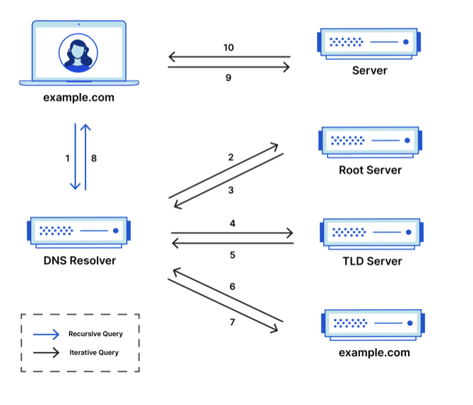
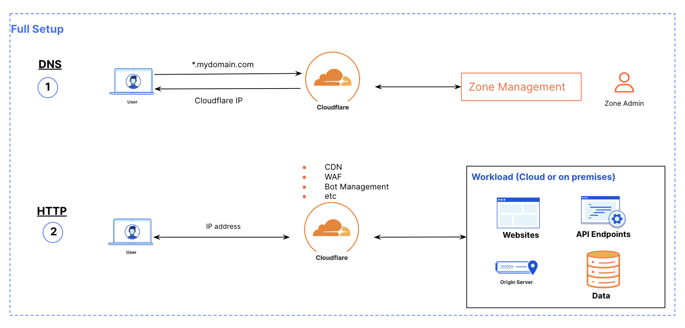
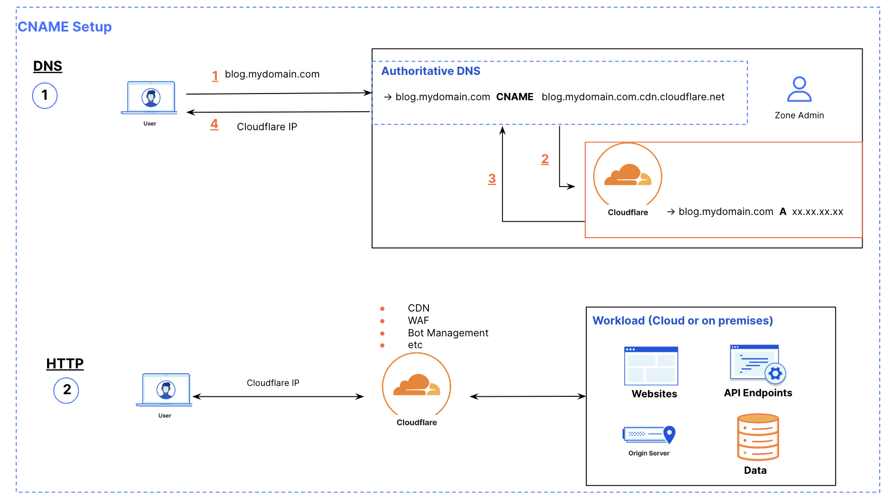
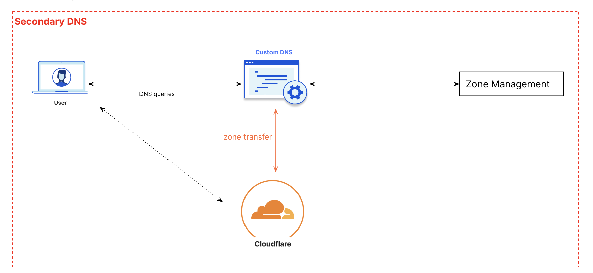

# Cloudflare DNS

Leverage Cloudflare’s global network to deliver excellent performance and reliability to your domain. 

## Prerequisites

*  Sign up for a Cloudflare Account : `https://dash.cloudflare.com/sign-up`
*  Buy a domain on your favorite registrar (GoDaddy, Route53, Google Domains, etc)

## 1. Main Features
Cloudflare DNS is an enterprise-grade authoritative DNS service that offers the fastest response time, unparalleled redundancy, and advanced security with built-in DDoS mitigation and DNSSEC.
* `Optimal Redundancy`: global Anycast network that allows DNS resolution at the network edge in each of their data centers across 310+ cities.
* `Security`:  built-in DDoS protection and one-click DNSSEC to ensure your applications are always safeguarded from DNS attacks.
* `Performance`: fastest DNS in the world, offering DNS lookup speed of 11ms on average and worldwide DNS propagation in less than five seconds.
* `Easy management`: user-friendly interfaces and access via API

## 2. Life of a request (DNS)
**The 8 steps of DNS Lookup:**

1. A user types ‘example.com’ into a web browser and the query travels into the Internet and is received by a **DNS recursive resolver**.
2. The resolver then queries a **DNS root nameserver** (.).
3. The root server then responds to the resolver with the address of a **Top Level Domain (TLD) DNS server** (such as .com or .net), which stores the information for its domains. When searching for example.com, our request is pointed toward the .com TLD.
4. The resolver then makes a request to the .com TLD.
5. The TLD server then responds with the IP address of the domain’s nameserver, example.com.
6. Lastly, the recursive resolver sends a query to the domain’s nameserver (**authoritative nameserver**).
7. The IP address for example.com is then returned to the resolver from the nameserver.
8. The DNS resolver then responds to the web browser with the IP address of the domain requested initially. (**Once the 8 steps of the DNS lookup have returned the IP address for example.com, the browser is able to make the request for the web page**:)
9. The browser makes a HTTP request to the IP address.
10. The server at that IP returns the webpage to be rendered in the browser (step 10).

## 3. Cloudflare Primary DNS
### 3.1 Full Setup
If you want to use Cloudflare as your primary DNS provider and manage your DNS records on Cloudflare, your domain should be using a full setup. This means that you are using Cloudflare for your authoritative DNS nameservers.

### 3.2 CNAME Setup
A partial (CNAME) setup allows you to use Cloudflare’s reverse proxy while maintaining your primary and authoritative DNS provider. Use this option to proxy only individual subdomains through Cloudflare’s global network when you cannot change your authoritative DNS provider.

The following diagram shows an example where you just want to *CNAME* the `blog` subdomain on Cloudflare

Note: If you don't know (behorehand) which subdomains to CNAME, you can create a Partial zone at the apex level by following these steps
1. Created a new partial zone on CF `mydomain.com`
2. Added a TXT record on your authoritative to verify the zone `cloudflare-verify.mydomain.com  TXT 228865695-972177847`
3. Create a CNAME on your authoritative, to proxy all the subdomains to CF `*.mydomain.com CNAME mydomain.com.cdn.cloudflare.net`

## 4. Cloudflare Secondary DNS
With incoming zone transfers, you can keep your primary DNS provider and use Cloudflare as a secondary DNS provider.

## 5. Tutorial
WIP