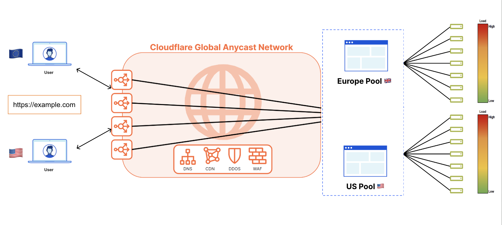

# Cloudflare Load Balancing

Maximize application performance and availability.

## Prerequisites

*  Sign up for a Cloudflare Account : `https://dash.cloudflare.com/sign-up`
*  Create a least two origin servers and take note of their IPs

## 1. Main Features
Cloudflare Load Balancing distributes traffic across your servers, which reduces server strain and latency and improves the experience for end users.

* `Load balancing and failover`: Distribute traffic evenly across your healthy servers, automatically failing over when a server is unhealthy or unresponsive.
* `​​Active monitoring`:  Monitor your servers at configurable intervals and across multiple data centers to look for specific status codes, response text, and timeouts.
* `Intelligent routing`: Choose whether to distribute requests based on server latency, a visitor’s geographic region, or even a visitor’s GPS coordinates.
* `Custom rules`: Customize the behavior of your load balancer based on the characteristics of individual requests.
* `Analytics`: Review comprehensive analytics to evaluate traffic flow, assess origin health status, and review changes in pools and pool health over time.

## 2. Global Network and Steering Policies
### 2.1 Global Network
By using Cloudflare Load Balancing, you can also benefit from a big range or security and performance services (WAF, CDN, DDoS, etc) in a single and unified platform

### 2.2 Steering Policies
* Traffic steering (between mutliple pools)
     * Standard: route pools in failover order
     * Geo: route to specific pools based on the Cloudflare region serving the request
     * Dynamic: route traffic to the fastest pool based on measured latency from health checks
     * Proximity: route requests to the closest physical pool
     * Least Outstanding Request: route traffic based on pool weights and number of pending requests

* Origin steering (between mutliple origins within a pool)
    * Random: send requests to origins purely based on origin weights
    * Hash: send requests to origins based on a combination of origin weights and previous requests from that IP address
    * Least Outstanding Request: send traffic to origins that currently have the fewest number of outstanding requests

## 3. Tutorial
WIP