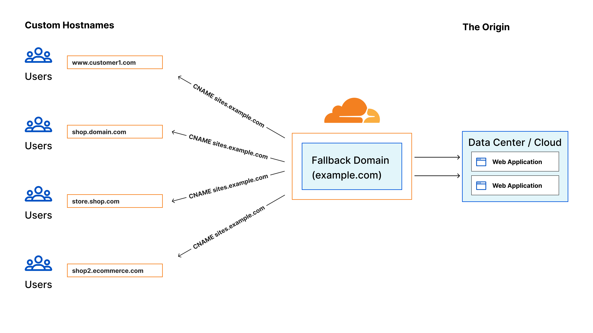
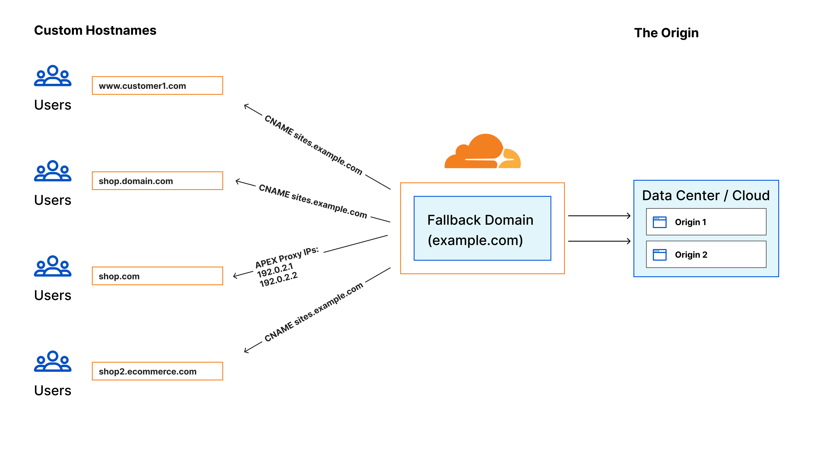
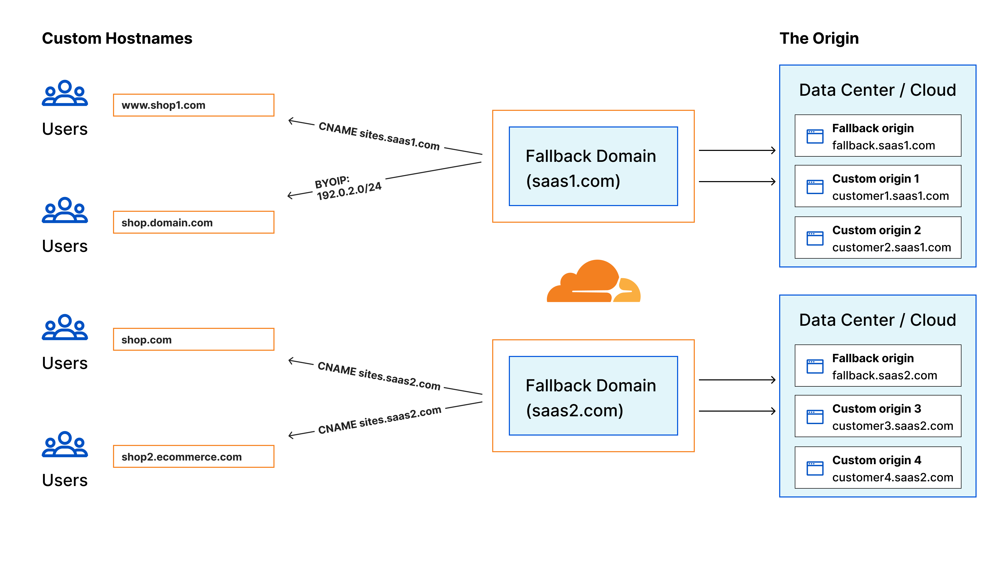

# Cloudflare SSL for SaaS

Cloudflare for SaaS allows you to extend the security and performance benefits of Cloudflare’s network to your customers via their own custom or vanity domains.

## Prerequisites

 *  Sign up for a Cloudflare Account : `https://dash.cloudflare.com/sign-up`
 *  Register `YOUR_DOMAIN` on Cloudflare DNS
 *  Enable Cloudflare for SaaS for your zone.

## 1. Concept

1. SSL for SaaS helps our customers to **extend the security and performance benefits that Cloudflare has to offer** to their customers through their custom (also known as vanity) domain.
2. Cloudflare can help SaaS Providers manage the entire certificate lifecycle of those custom domains, from initial issuance to renewal.
3. **Use cases**:
    1. SaaS providers (e.g Shootify) offer their services with the vanity domain names of their customers (e.g tmsquare.net) through DNS to the SaaS provider IP and/or domain name. **The provider uses Cloudflare services and want to extend these services to their end users**.
    2. SaaS providers **want to resell Cloudflare services to their customers** by having their customers point to the SaaS provider IP and/or domain name.

## 2. How does it work ?
- As a SaaS provider, you can extend Cloudflare’s products to customer-owned custom domains by adding them to your zone as custom hostnames.
- Through a suite of easy-to-use products, Cloudflare for SaaS routes traffic from custom hostnames to an origin, set up on your domain. Cloudflare for SaaS is highly customisable.
- Three possible configurations: 
    1. **Standard**: Custom hostnames are routed to a default origin server called fallback origin. 
    
    ssl_for_saas_apex
    2. **Apex Proxying**: This allows you to support apex domains even if your customers are using a DNS provider that does not allow a CNAME at the apex.
     
    3. **BYOIP**: This allows you to support apex domains even if your customers are using a DNS provider that does not allow a CNAME at the apex. Also, you can point to your own IPs if you want to bring an IP range to Cloudflare (instead of Cloudflare provided IPs).
     

## 3. Tutorial
WIP

