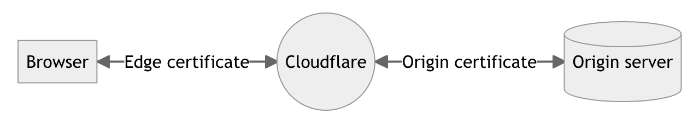
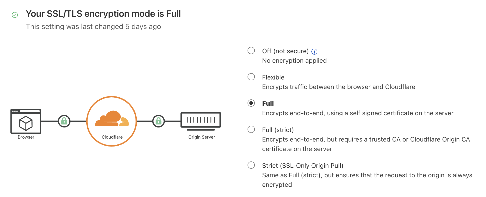

# Cloudflare SSL/TLS

Encrypt your web traffic to prevent data theft and other tampering.

## Prerequisites

 *  Sign up for a Cloudflare Account : `https://dash.cloudflare.com/sign-up`
 *  Register `YOUR_DOMAIN` on Cloudflare DNS

## 1. Basics

An SSL/TLS certificate is what enables websites and applications to establish secure connections. With SSL/TLS, a client - such as a browser - can verify the authenticity and integrity of the server it is connecting with, and use encryption to exchange information.

1. Edge and Origin certificates:
    - The **edge certificates** are the ones that Cloudflare presents to clients visiting your website or application. Managed through the CF Dash 
    - **Origin Certificates** guarantee the security and authentication on the other side of the network, between Cloudflare and the origin server of your website or application. Origin certificates are managed on your origin server
    
2. Origin pulls:
When visitors request content from your website or application, Cloudflare first attempts to serve content from the cache. If this attempt fails, Cloudflare sends a request back to your origin web server to get the content. This request between Cloudflare and your origin web server is called origin pull.

## 2. Cloudflare SSL/TLS 
Helps to save time on certificate management, issue and auto-renew TLS certificates. It supports many types of edge certificates:

1. `Universal SSL`: By default, Cloudflare issues — and renews — free, unshared, publicly trusted SSL certificates to all domains added to and activated on Cloudflare.  
2. `Custom SSL`: meant for Business and Enterprise customers who want to use their own SSL certificates
3. `Dedicated SSL or Advanced Certificate Manager (ACM)`: for something more customisable than Universal SSL but still, with the convenience of SSL certificate issuance and renewal by Cloudflare. (and you can go to another level deeper like *.api.my_domain.com which is not possible with universal ssl)
4. `Origin CA certificate`: generate a certificate from cloudflare and install it on your origin → only allow your origin to trust Cloudflare edge servers
5. `Keyless certificates`: allows security-conscious clients to upload their own custom certificates and benefit from Cloudflare, but without exposing their TLS private keys.
6. Encryption modes: 

## 3. How do SSL certificates work ?
1. SSL certificates include the following information in a single data file
    - the **domain name** used for
    - person, **organization**, or device it was issued to
    - **certificate authority** (CA) issued it
    - CA's digital signature
    - Associated **subdomains**
    - **Issue date** of the certificate
    - **Expiration date** of the certificate
    - The **public key** (the private key is kept secret)
2. The public and private keys used for SSL are used for encrypting and signing data. The certificate is store on the origin server, and is sent to any devices that request to load the website.
3. CA are providing SSL certificates (not free most of the time). And Cloudflare offers free edge certificates called **Cloudflare UNIVERSAL SSL**
4. You can choose to use self-signed certificated (key pair generated by yourself). But this is not trusted by browsers (since there is no CA signing it). Even if the connection is secure (https).

## 4. Types of SSL certificates
1. **Single Domain SSL certificates**: only valid for one and only domain (no sub)
2. **Wildcard SSL certificates**: for a single domain and all its subdomains.
3. **Multi-Domain SSL Certificates**: multiple distinct domains on one certificate

## 5. SSL certificate validation levels 
Before a certificate authority (CA) issues an SSL certificate to an organisation, they have to validate the organisation; it has to be proven that the organisation actually owns and operates the domain. This is what's known as SSL certificate validation.

1. **Domain validation SSL certificates (DV)**: the least-stringent level of validation. To obtain one of these SSL certificates, an organization only has to prove they control the domain. They can do this by altering the DNS record associated with the domain, or sometimes just by sending the CA an email. Often the process is automated. 
2. **Organisation validation  SSL certificates (OV)**: involves a manual vetting process → The CA will contact the organization requesting the SSL certificate, and they may do some further investigating. Organization Validation SSL certificates will contain the organization's name and address
3. **Extended validation  SSL Certificates (EV)**: involves a full background check of the organization. The CA will make sure that the organization exists and is legally registered as a business, that they actually are present at the address they list, and so on.

## 6. Tutorial
WIP