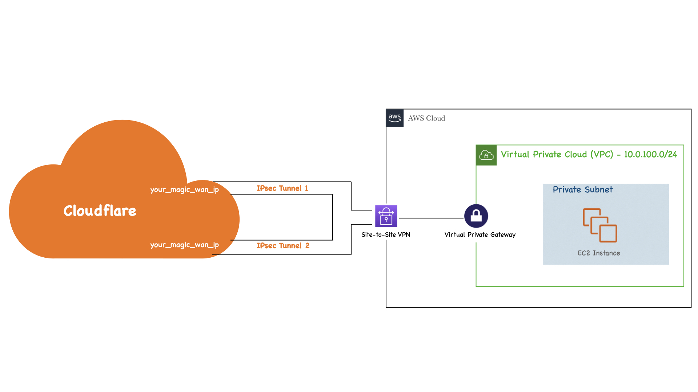

# Welcome to your AWS Site-to-Site-VPN Python project!

This project helps you to deploy the following environment on AWS (for your Magic WAN quick demos).


## 1. Define the configurations
Create a copy of the configuration file

```
$ cp config_template.yaml config.yaml
```

Please update the configurations on the `config.yaml` file depending on you current account (modify the `"TO BE FILLED"` sections)

## 2. Setup the environement
Manually create a virtualenv on MacOS and Linux:

```
$ python3 -m venv .venv
```

After the init process completes and the virtualenv is created, you can use the following
step to activate your virtualenv.

```
$ source .venv/bin/activate
```

If you are a Windows platform, you would activate the virtualenv like this:

```
% .venv\Scripts\activate.bat
```

Once the virtualenv is activated, you can install the required dependencies.

```
$ pip3 install -r requirements.txt
```

Now, you can configure AWS in your current terminal (your will need your `AWS Access Key ID` and `AWS Secret Access Key`). You can also set `us-east-1` as the defaut region 

```
$ aws configure
```

At this point you can now bootstrap the CloudFormation template for this code.

```
$ cdk bootstrap
```


## 3. Useful commands

 * `cdk synth`       emits the synthesized CloudFormation template
 * `cdk deploy`      deploy this stack to your default AWS account/region
 * `cdk destroy`     destroy this stack from your default AWS account/region

## 4. Update the config file with the output parameters

```
$ python3 update_yaml.py
```
